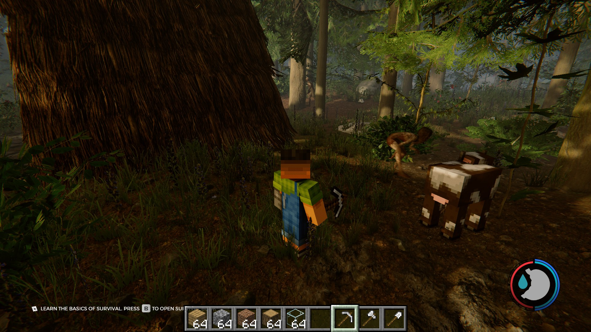

# ForestCraft

Play **The Forest** with a **Minecraft** body: physics, sprinting, jumping, your hand, hotbar,
inventory, chat, blocks, mobs and combat all come from a hidden Minecraft 26.2 (Fabric)
running in the background, while you see the world of The Forest. Inspired by
[SkyCraft](https://github.com/chasmlol/SkyCraft).



> Single-player only for now. Windows only.
>
> **⚠️ Turn V-Sync off in The Forest's options and set an FPS cap in F8 → Perf** (see [Installation](#installation-players)).

## Requirements

- **The Forest** (Steam, PC)
- **Minecraft: Java Edition** (a Microsoft account that owns the game)
- Nothing else: the installer takes care of BepInEx, Prism Launcher, the Minecraft 26.2 +
  Fabric instance and Java 25.

## Installation (players)

1. Download `ForestCraft-x.y.z.zip` from the **Releases** page and extract it.
2. Double-click **`install.bat`**.
3. First time only: in Prism Launcher, add your Microsoft account
   (top right → *Manage Accounts*) and launch the **ForestCraft** instance once so Prism
   downloads Minecraft and Java (it may close on its own, that's expected).
4. Start **The Forest** from Steam. Minecraft starts by itself in the background.

> [!IMPORTANT]
> ## ⚠️ Before playing: turn V-Sync OFF and set an FPS cap
>
> 1. **In The Forest's options, turn V-Sync off.** With V-Sync on, the FPS cap is ignored and
>    The Forest runs as fast as your screen (144 Hz, 165 Hz…): Minecraft, which shares the
>    graphics card and draws your hand and HUD, then stutters.
> 2. **In game, press F8 → page *Perf* and pick a cap that fits your PC:**
>
>    | Your PC | Cap |
>    |---|---|
>    | Modest (older or laptop graphics card) | **60 FPS** |
>    | Mid-range | **90 FPS** |
>    | Powerful | **120 FPS** (default) |
>
>    If Minecraft's hand or HUD still stutters, take the step below. Avoid *Unlimited FPS*.

To update: download the new release and run `install.bat` again.
To reset everything (Minecraft world + dug terrain): `reset.bat`
(your The Forest saves are not touched).

What `install.bat` does:

| Step | Details |
|---|---|
| The Forest | found through Steam (all libraries), otherwise it asks for the folder |
| BepInEx 5.4.23.2 x64 | downloaded from GitHub and installed into the game folder if missing |
| Plugin | `ForestCraft.dll` → `The Forest\BepInEx\plugins` |
| Prism Launcher | detected, otherwise installed with `winget` (or opens the download page) |
| Instance | `ForestCraft` created: Minecraft 26.2 + Fabric Loader 0.19.3, automatic Java |
| Mod | `forestcraft.jar` → the instance's `mods` folder |

## Controls

| Key | Action |
|---|---|
| WASD (ZQSD on AZERTY) / Space | move / jump (Minecraft physics) |
| Ctrl | sprint · Shift / C: sneak |
| Left click | break / hit (trees, bushes, suitcases, cannibals…) |
| Right click | place / use |
| 1–9, mouse wheel | hotbar |
| E | pick up / interact in The Forest (picked-up items become Minecraft items); at a cave mouth or a rope: straight through to the other side |
| M | The Forest's map in Steve's hands (once found, as in the game; F8 > World gives it) |
| I | Minecraft inventory |
| T, / | chat, command |
| F5 | third-person view |
| F1 | developer console (see below) |
| F8 | test menu (see below) |
| F9 | how the ground around holes is drawn: The Forest's terrain / Minecraft grass / nothing |

## Digging

Hold left click on the ground to dig it out one block at a time, like dirt (sand on the beaches,
stone deeper down, which needs a pickaxe). The hole is cut exactly into The Forest's terrain: the ground around it
keeps The Forest's look, and the sides of the hole are dirt faces cut along the surface. Ground
fully under the surface next to a hole turns into real Minecraft blocks, so you can keep mining
down or sideways like in Minecraft.

How the ground around holes is drawn can be changed in
`The Forest\BepInEx\config\dev.forestcraft.cfg` → `DugGroundLook = Terrain` (The Forest's own
ground) or `Grass` (Minecraft grass).

## Fighting and hunting

Minecraft's weapons work on The Forest's cannibals and animals: melee hits (with Minecraft's
damage and attack cooldown) and arrows, which stay planted where they hit. Hit a dead animal to
cut it up (meat, skin, bones). Picked-up items become their Minecraft counterpart; story items
(maps, photos, keycards, tapes…) and tools only The Forest can use stay in its inventory.

Minecraft animals and monsters (spawn eggs) walk on The Forest's island and find their way
around it.

## Caves and ropes

Cave mouths and doors take you straight through (no squeeze animation, no fade), and E at a rope
takes you to its other end, onto the ground beside the top or down at its foot. Ropes can also be
climbed like ladders: forward or Space up, back down, Shift to hold on. Stuck somewhere? F8 >
Player > Unstuck puts you back on the surface.

## Size

`Scale` in `dev.forestcraft.cfg` (section `[World]`) sets how big Steve and the blocks are, in
The Forest's units per block (0 = automatic, 1.8 at most). Each Minecraft world keeps the size
it was created with (`forestcraft_scale.txt` in the world folder), so blocks and holes never
move; a new size applies to new games.

## Minecraft tools on The Forest's creatures

Right click a cannibal or an animal with:

| Item | Does |
|---|---|
| Flint and steel, fire charge | sets it alight (The Forest's own fire) |
| Lava bucket | soaks it in fire: a long, strong burn, and it hurts |
| Water bucket | puts the fire out |
| Lead | ties it up: it is dragged along behind you; right click again to untie, too far and it snaps |

Steve's fire and lava burn creatures that walk into them, his water puts them out, and TNT or
creeper explosions blow them up the way The Forest's bombs do, bring down the trees around
and leave a crater in the ground.

## Performance

**Turn V-Sync off in The Forest's options and pick an FPS cap in F8 → Perf** (60, 90, 120 or 144;
see the box under *Installation*). The cap is also `[Performance] MaxFps` in
`dev.forestcraft.cfg` (120 by default, 0 = no cap). Both games share the graphics card: with The
Forest running flat out, Minecraft (which draws the hand and the HUD) has to wait its turn and
stutters for up to 200 ms. With the cap it stays smooth, even in Ultra. If V-Sync is left on and
the screen is faster than the cap, ForestCraft turns V-Sync off itself.

## Test menu (F8)

F8 opens a clickable menu over the game; the mouse moves its cursor, F8 or Escape closes it,
Tab switches page. Nothing reaches the game while it is open.

| Page | Buttons |
|---|---|
| Cannibals | every cannibal and mutant (Virginia, Armsy, Cowman, babies…), a group of 5, kill / knock out the closest, kill all, enemies on/off |
| Animals | rabbit, lizard, deer, boar, raccoon, squirrel, turtles, crocodile; kill; animals and birds on/off |
| Minecraft mobs | zombie, skeleton, creeper, spider, enderman, witch, farm animals, wolf, fox, horse, villager, iron golem; kill nearby Minecraft mobs |
| Player | invincible, heal, creative mode, night vision, speed, XP, invisible to enemies, infinite energy, unstuck (back up onto the surface, out of the caves), die (Minecraft or The Forest) |
| Items | diamond sword and tools, bow and arrows, iron/diamond armour, torches, food, blocks, clear inventory; all of The Forest's items |
| World | noon, midnight, sunset, rain, sun, The Forest's map with every cave revealed, go to the plane wreck, instant building, save |
| Perf | cap The Forest at 60 / 90 / 120 / 144 FPS, or no cap |

Minecraft commands from the menu (and from `mc` in the console) run with operator rights, so
they work in a world without cheats. `[Debug] ModMenu = false` in the config turns the menu off.

## Developer console

F1 opens The Forest's own developer console (the one `developermodeon` unlocks), switched on
by the mod; Enter runs the command. A few useful ones:

| Command | Does |
|---|---|
| `spawnmutant male` | a cannibal next to you (`female`, `male_skinny`, `pale`, `fireman`, `armsy`, `vags`, `baby`, `fat`…) |
| `spawnanimal rabbit` | an animal (`deer`, `boar`, `lizard`, `raccoon`, `turtle`…) |
| `killallenemies`, `killclosestenemy` | clean up |
| `goto Hull` | go somewhere (Minecraft follows) |
| `setCurrentDay 10`, `advanceday` | time |
| `help` | every command |
| `mc <command>` or `/<command>` | a Minecraft command: `mc summon zombie`, `mc give @p diamond_sword`, `mc time set night` |

Turn it off with `DeveloperConsole = false` (section `[Debug]` of `dev.forestcraft.cfg`).

## Saves

Each The Forest save slot has its own Minecraft world (blocks, holes, inventory). It is saved
when you save in The Forest, and loaded with that slot; a new game starts a fresh Minecraft
world. The worlds are `ForestCraft_Slot1` … `ForestCraft_Slot5` in the Prism instance
(`ForestCraft_Play` is the one being played).

## Building from source (developers)

Requirements: The Forest installed, the [.NET SDK](https://dotnet.microsoft.com/download) (6 or newer).
JDK 25 is downloaded automatically into `.tools\` if none is found.

- `build.bat` → builds both halves and creates `dist\ForestCraft-<version>.zip` (the zip to
  attach to a GitHub release).
- `install.bat` run from the repository → builds, then installs directly.

Layout:

```
forest/    BepInEx plugin for The Forest (C#, net35)
fabric/    Fabric mod for Minecraft 26.2 (Java 25)
scripts/   installer, build, reset (PowerShell)
```

The two games talk through shared memory (`%LOCALAPPDATA%\ForestCraft\link.bin`).

## Publishing a release

```bat
build.bat
git tag v0.4.0 && git push origin v0.4.0
gh release create v0.4.0 dist\ForestCraft-0.4.0.zip --title "ForestCraft 0.4.0" --notes-file dist\notes.md
```

## License

MIT — see [LICENSE](LICENSE). This project contains no files from The Forest or Minecraft;
you need to own both games. Not affiliated with Endnight Games, Mojang or Microsoft.
